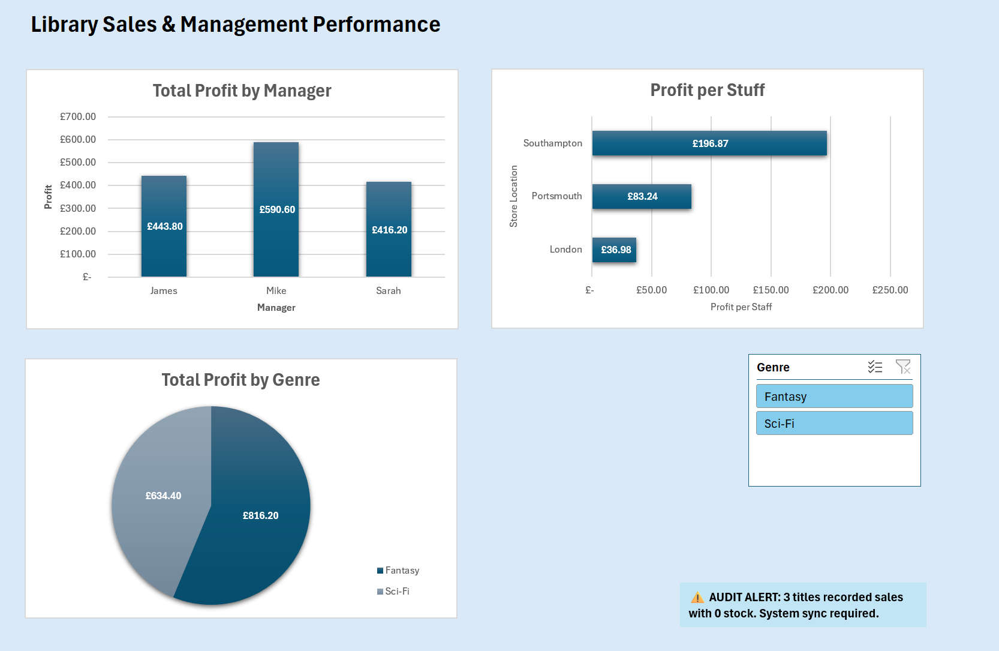

📚 Book Inventory & Sales Analysis Project

Excel data modelling and financial analysis project for a multi-location bookstore.
A Data Transformation & Business Intelligence Case Study

📖 Project Overview
This project demonstrates the transition from raw, fragmented data into a structured relational data model. The goal is to provide a library manager with actionable insights into sales performance, profitability, and inventory levels across three key locations: Portsmouth, London, and Southampton.

Raw Data Sample (Before):
Plaintext
ORD-101, 15/02/26, BK001, portsmouth, 2
ORD-102, 2026-02-15, BK003, London, 5
🛠️ Step 1: Data Cleaning & Organisation
The raw transaction data was initially inconsistent. I performed the following cleaning steps to ensure accuracy:

Deduplication: Audited the Order_ID sequence to ensure data integrity and unique transaction records.

Casing Standardisation: Standardised Store_Location entries using the =PROPER() function to fix casing errors (e.g., "portsmouth" to "Portsmouth").

Date Normalisation: Converted various date strings into a uniform format (YYYY-MM-DD) to allow for accurate time-series analysis.

🏗️ Step 2: Relational Data Modelling
Instead of maintaining one massive, inefficient sheet, I structured the data into three relational tables to improve performance and scalability:

Tab_Sales: Daily transaction logs.

Tab_Products: Master product list with pricing and cost data.

Tab_Managers: Store-specific metadata including staffing levels.

Technical Implementation:
Official Tables: Converted all data ranges into Official Excel Tables (Ctrl + T).

Dynamic Lookups: Used XLOOKUP to dynamically pull Unit Price and Unit Cost from the Products table.

Data Model: Established relationships within the Excel Data Model to link tables via Book_ID and Store_Location.

📊 Step 3: Financial Logic & Metrics
I engineered specific calculated columns to track business health and profitability:

Total Revenue: [Units_Sold] * [Unit_Price]

Total Cost: [Units_Sold] * [Unit_Cost]

Total Profit: [Total_Revenue] - [Total_Cost]

💡 Step 4: Executive Insights & Business Intelligence
Once the Data Model was established, I analysed the performance metrics to answer key business questions:

Top Manager Performance: Mike (Southampton) is the most profitable manager, generating £590.60 in total profit.

Genre Trends: Fantasy is the dominant genre, contributing £816.20 to the total profit, significantly outperforming Sci-Fi.

Operational Efficiency: I calculated Profit per Staff Member to measure store productivity. Despite having the smallest team, Southampton is the most efficient location, generating £196.87 per employee—over 5 times the efficiency of the London branch (£36.98).

🛠️ Challenges & Technical Audit
During the project, I encountered and resolved several technical and operational issues:

Data Model Synchronisation: Added calculated columns (Total Profit/Cost), which were initially missing from the PivotTable fields.

Solution: Manually re-initialised the Power Pivot Data Model connections and performed a full cache refresh to restore data visibility.

Inventory Integrity Audit: Discovered a critical system discrepancy where three titles (Red Sister, Project Hail Mary, The Lies of Locke Lamora) recorded sales despite having 0 units in stock.

Recommendation: Flagged for a mandatory inventory sync between the sales floor and the digital warehouse database.

📈 Final Dashboard Features
The final interactive dashboard includes:

Dynamic Slicers: Allows filtering all charts by "Genre" with a single click.

Profitability Mix: Visual breakdown of profit by Manager and Genre.

Efficiency Bar Chart: Clear visualisation of which store provides the best ROI on staffing.
